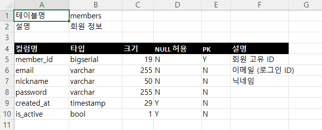

# DB Metadata Generator


여러 데이터베이스에 연결해 테이블 구조(메타데이터)를 자동으로 추출하고, **Excel 테이블 정의서**와 **Java VO 클래스 코드**를 자동 생성하는 개발 지원 도구입니다.

---

## 📌 프로젝트 배경

실무에서 공공기관·협회 대상 프로젝트를 진행하며, 다중 DB(Oracle / MariaDB / PostgreSQL) 환경의 **테이블 정의서를 수기로 관리하는 비효율**을 반복적으로 겪었습니다. 컬럼이 추가되거나 타입이 변경될 때마다 개발자가 직접 Excel을 수정해야 했고, 그 과정에서 실제 DB 스키마와 문서가 어긋나는 일도 잦았습니다.

이를 해결할 자동화 도구를 사내에서 기획했으나 우선순위에 밀려 완성하지 못했고, 그때의 문제의식을 개인 프로젝트로 재설계하여 구현했습니다.

동시에 실무에서 사용하던 레거시 스택(eGovFrame / Spring MVC / MyBatis / XML 설정)을 **Spring Boot / JPA / 어노테이션 기반**의 모던 스택으로 전환해 구현하는 것을 목표로 삼았습니다.

---

## 🛠 기술 스택

| 구분 | 기술 | 선택 이유 |
|---|---|---|
| Language | Java 17 | Spring Boot 3.x 이상 요구사항, 최신 문법 활용 |
| Framework | Spring Boot 4.1.1 | XML 설정 기반 레거시에서 어노테이션 기반으로 전환 |
| 빌드 도구 | Gradle | 실무에서 사용하던 Maven 대비 간결한 설정, 최근 채택 추세 |
| ORM | Spring Data JPA (Hibernate) | 애플리케이션 자체 데이터 관리용 |
| DB 접근 | JDBC (`DatabaseMetaData`) | 사용자가 등록한 임의의 DB에 **동적 연결**이 필요해 JPA 대신 직접 사용 |
| Database | PostgreSQL 16, MariaDB 11 | 다중 DB 지원 검증 (Oracle은 라이선스 이슈로 제외) |
| 문서 생성 | Apache POI | Java 진영 Excel 처리 표준 라이브러리 |
| 코드 생성 | Freemarker | HTML에 종속되지 않는 범용 텍스트 생성 (Thymeleaf 대비 코드 생성에 적합) |
| 보안 | Jasypt (AES-256) | DB 접속 비밀번호 암호화 저장 |
| 테스트 | JUnit 5, AssertJ | 단위 / 통합 테스트 |
| 인프라 | Docker, Docker Compose | 로컬 개발 환경 및 애플리케이션 컨테이너화 |
| CI | GitHub Actions | push 시 자동 빌드 및 테스트 |

---

## ✨ 주요 기능

### 1. DB 연결 정보 관리
- 여러 DB 접속 정보를 등록·조회하고, 실제 연결 가능 여부를 사전 테스트
- **비밀번호는 AES-256으로 암호화되어 저장**되며, 조회 시 자동 복호화

### 2. 메타데이터 자동 추출
- JDBC `DatabaseMetaData`를 활용해 테이블 목록, 컬럼명, 데이터 타입, 크기, NULL 허용 여부, **PK 여부**, 테이블/컬럼 코멘트를 조회
- PostgreSQL과 MariaDB의 방언(dialect) 차이를 흡수하는 구조

### 3. Excel 테이블 정의서 생성
- 추출한 메타데이터를 즉시 `.xlsx` 파일로 다운로드
- 서버에 임시 파일을 남기지 않고 메모리에서 직접 생성



### 4. Java VO 코드 자동 생성
- DB 스키마 기반으로 Lombok 어노테이션이 적용된 VO 클래스 코드 생성
- 스네이크케이스 → 카멜케이스 자동 변환, DB 타입 → Java 타입 매핑
- 사용된 타입에 따라 필요한 `import` 문을 조건부로 자동 삽입

---

## 📡 API 명세

| Method | Endpoint | 설명 |
|---|---|---|
| `POST` | `/api/connections` | DB 연결 정보 등록 (비밀번호 자동 암호화) |
| `GET` | `/api/connections` | 전체 연결 목록 조회 |
| `GET` | `/api/connections/{id}` | 연결 정보 단건 조회 |
| `POST` | `/api/connections/test` | 실제 DB 연결 테스트 (저장 없이 확인) |
| `GET` | `/api/metadata/{connectionId}/tables` | 테이블 목록 조회 |
| `GET` | `/api/metadata/{connectionId}/tables/{tableName}` | 테이블 상세 메타데이터 조회 |
| `GET` | `/api/export/excel/{connectionId}/tables/{tableName}` | Excel 정의서 다운로드 |
| `GET` | `/api/export/code/{connectionId}/tables/{tableName}/vo` | VO 클래스 코드 생성 |

### 요청 / 응답 예시

**연결 정보 등록**

```http
POST /api/connections
Content-Type: application/json

{
  "name": "운영 PostgreSQL",
  "dbType": "POSTGRESQL",
  "host": "postgres",
  "port": 5432,
  "databaseName": "sampledb",
  "username": "dev",
  "password": "dev1234"
}
```

**테이블 상세 조회 응답**

```json
{
  "tableName": "members",
  "remarks": "회원 정보",
  "columns": [
    {
      "columnName": "member_id",
      "dataType": "bigserial",
      "columnSize": 19,
      "nullable": false,
      "primaryKey": true,
      "remarks": "회원 고유 ID"
    },
    {
      "columnName": "email",
      "dataType": "varchar",
      "columnSize": 255,
      "nullable": false,
      "primaryKey": false,
      "remarks": "이메일 (로그인 ID)"
    }
  ]
}
```

**VO 코드 생성 결과**

```java
package com.portfolio.dbmetadatagenerator.generated;

import lombok.Getter;
import lombok.Setter;
import java.time.LocalDateTime;

/**
 * 회원 정보
 */
@Getter
@Setter
public class MembersVO {

    /**
     * 회원 고유 ID
     */
    private Long memberId;

    /**
     * 이메일 (로그인 ID)
     */
    private String email;

    /**
     * 닉네임
     */
    private String nickname;

    private LocalDateTime createdAt;
}
```

**에러 응답 형식 (전역 예외 처리)**

```json
{
  "status": 404,
  "errorCode": "CONNECTION_NOT_FOUND",
  "message": "연결 정보를 찾을 수 없습니다. id=999",
  "timestamp": "2026-09-17T16:56:19.480"
}
```

---

## 🏗 아키텍처

### 패키지 구조 (기능별 분리)

```
com.portfolio.dbmetadatagenerator
├── connection/          # DB 연결 정보 관리 + 암호화
├── metadata/            # 메타데이터 조회
├── export/
│   ├── excel/           # Excel 정의서 생성
│   └── code/            # 코드 자동 생성
└── common/              # 전역 예외 처리, 공통 응답
```

계층별(`controller/`, `service/`)이 아닌 **기능별(Package by Feature)** 구조를 채택했습니다. 기능 단위로 관련 파일이 모여 있어, 특정 기능을 수정할 때 여러 패키지를 오갈 필요가 없습니다.

### 이중 DB 접근 전략

이 프로젝트는 성격이 다른 두 종류의 DB 접근이 공존합니다.

| 대상 | 접근 방식 | 이유 |
|---|---|---|
| 애플리케이션 자체 DB (연결 정보 저장) | **JPA / Hibernate** | 스키마가 고정되어 있어 ORM의 생산성 이점을 활용 |
| 사용자가 등록한 대상 DB | **JDBC 직접 사용** | 런타임에 임의의 DB로 동적 연결해야 하므로 ORM 부적합 |

### 요청 처리 흐름

```
Client
  ↓
Controller  (요청 수신 / 응답 형식 결정)
  ↓
Service     (비즈니스 로직)
  ↓
Repository (JPA) ────→ 애플리케이션 DB
  또는
JDBC DriverManager ──→ 사용자가 등록한 대상 DB
```

Excel 생성과 코드 생성 기능은 각각 **`MetadataService`(조회) + `ExcelExportService` / `CodeGenerateService`(변환)** 를 Controller에서 조합하는 방식으로 구현했습니다. 각 Service가 단일 책임을 유지하도록 설계한 결과, 새로운 출력 형식을 추가할 때 조회 로직을 그대로 재사용할 수 있습니다.

### 보안 설계

- DB 접속 비밀번호는 JPA `AttributeConverter`를 통해 **저장 시 자동 암호화, 조회 시 자동 복호화**됩니다.
- Service / Controller 계층은 암호화 적용 사실을 알 필요가 없어, 관심사 분리가 유지됩니다.
- 암호화 키는 코드나 설정 파일이 아닌 **환경변수(`JASYPT_ENCRYPTOR_PASSWORD`)로 주입**하여 저장소에 노출되지 않도록 했습니다.

---

## 🚀 실행 방법

### 사전 요구사항
- Docker / Docker Compose

### 전체 실행 (애플리케이션 + DB)

```bash
git clone https://github.com/kang1597/db-metadata-generator.git
cd db-metadata-generator
docker compose up -d
```

이후 `http://localhost:8080`으로 접근할 수 있습니다.

> 컨테이너 내부에서 실행되므로, 연결 정보 등록 시 `host`는 `localhost`가 아닌 **서비스명(`postgres`, `mariadb`)** 을 사용해야 합니다.

### DB만 띄우고 IDE에서 실행하는 경우

```bash
docker compose up -d postgres mariadb
```

이 경우 환경변수 `JASYPT_ENCRYPTOR_PASSWORD` 설정이 필요하며, 연결 정보의 `host`는 `localhost`를 사용합니다.

### 접속 정보 (로컬 개발용)

| | PostgreSQL | MariaDB |
|---|---|---|
| Host (IDE 실행 시) | localhost | localhost |
| Host (컨테이너 실행 시) | postgres | mariadb |
| Port (호스트) | 5432 | 3307 |
| Database | sampledb | sampledb |
| User / Password | dev / dev1234 | dev / dev1234 |

### 테스트 실행

```bash
docker compose up -d postgres   # 통합 테스트용 DB 필요
./gradlew test
```

---

## 🧪 테스트

| 테스트 클래스 | 종류 | 검증 내용 |
|---|---|---|
| `CodeGenerateServiceTest` | 단위 (7건) | 케이스 변환, DB 타입 → Java 타입 매핑 |
| `MetadataServiceTest` | 통합 (6건) | PostgreSQL / MariaDB 각각에 대해 테이블 목록 조회, PK 판별, 코멘트 추출 검증 |

- 외부 의존성이 없는 순수 로직은 Spring 컨텍스트 없이 단위 테스트로, DB 연동이 필요한 로직은 `@SpringBootTest` 기반 통합 테스트로 분리했습니다.
- 통합 테스트는 `@Nested`로 DB별 그룹을 나눠, **동일한 검증 기준을 두 DB에 각각 적용**했습니다.
- 통합 테스트는 `@Transactional`을 적용해 각 테스트 종료 시 데이터가 롤백되도록 하여 테스트 간 독립성을 보장합니다.
- GitHub Actions를 통해 `main` 브랜치 push 시 **PostgreSQL과 MariaDB 컨테이너를 모두 띄운 상태에서 전체 테스트가 자동 실행**됩니다.

---

## 🔧 트러블슈팅

### 1. Jasypt AES 알고리즘 적용 시 암호화 실패

**문제**  
비밀번호 암호화 적용 후 연결 정보 등록 시 `EncryptionOperationNotPossibleException`이 발생했습니다. Jasypt는 보안상 상세 원인을 노출하지 않아 로그만으로는 원인 파악이 어려웠습니다.

**원인**  
`PBEWITHHMACSHA512ANDAES_256` 같은 AES 계열 알고리즘은 **IV(초기화 벡터) Generator를 명시적으로 지정해야** 동작합니다. 구버전 알고리즘(DES 계열)에서는 필요 없던 설정이라 누락했습니다.

**해결**  
`SimpleStringPBEConfig`에 `setIvGenerator(new RandomIvGenerator())`를 추가했습니다. IV는 동일한 평문을 같은 키로 암호화해도 매번 다른 암호문이 생성되도록 하는 무작위 값으로, 암호문 자체에 포함되어 저장되므로 별도 관리가 필요 없습니다.

---

### 2. 암호화 도입 시 기존 평문 데이터와의 충돌

**문제**  
암호화 적용 후 전체 목록 조회 API가 500 에러를 반환했습니다.

**원인**  
암호화 적용 **이전에** 저장된 레코드의 비밀번호는 평문인데, 조회 시 `AttributeConverter`가 이를 암호문으로 간주하고 복호화를 시도하면서 실패했습니다.

**해결**  
테스트 데이터였으므로 해당 레코드를 삭제해 해결했습니다. 다만 이는 **운영 환경이라면 기존 데이터를 일괄 암호화하는 마이그레이션 작업이 필요한 상황**이며, 보안 요구사항을 뒤늦게 추가할 때 실제로 마주치는 문제를 경험할 수 있었습니다.

---

### 3. Testcontainers 도입 시도와 대안 선택

**문제**  
실행 환경에 의존하지 않는 통합 테스트를 위해 Testcontainers를 도입하려 했으나 `Could not find a valid Docker environment` 에러가 발생했습니다.

**원인 규명 과정**  
처음에는 Docker 컨테이너 미실행을 원인으로 추정했습니다. 그러나 컨테이너를 정상 기동한 상태에서 재시도해도 동일한 에러가 재현되어 해당 가설을 기각했습니다. 로그의 `NpipeSocketClientProviderStrategy` 실패와 Docker 설치 경로(`AppData\Local`)를 근거로, **Docker Desktop의 Per-user 설치 방식에서 비롯된 소켓 접근 제약**으로 원인을 좁혔습니다.

**판단**  
TCP 소켓 노출 옵션을 활성화하는 우회 방법이 있었으나, Docker가 명시적으로 원격 코드 실행 취약점을 경고하는 설정이었습니다. 전체 재설치 역시 시간 대비 효용이 낮다고 판단해, **로컬 docker-compose 환경을 전제한 통합 테스트로 전환**했습니다. 시도한 코드는 `@Disabled`와 사유를 명시해 보존했으며, CI 환경에서의 재도입을 계획하고 있습니다.

---

### 4. 컨테이너 환경 전환 시 `localhost` 의미 변화

**문제**  
애플리케이션을 컨테이너화한 후, 기존에 등록해둔 DB 연결 정보로 메타데이터를 조회하니 `DATABASE_ERROR`가 발생했습니다.

**원인**  
저장된 연결 정보의 `host` 값이 `localhost`였습니다. IDE에서 실행하던 시점에는 애플리케이션이 호스트 머신에서 동작했으므로 유효한 값이었지만, 컨테이너 내부에서 `localhost`는 **컨테이너 자기 자신**을 가리키므로 PostgreSQL을 찾을 수 없었습니다.

**해결**  
Docker Compose가 제공하는 내부 DNS를 이용해 `host`를 서비스명인 `postgres`로 지정했습니다. 애플리케이션 자체의 DataSource URL 역시 동일한 이유로 `jdbc:postgresql://postgres:5432/...` 형태로 환경변수를 통해 주입하도록 구성했습니다.

**배운 점**  
컨테이너 환경에서는 네트워크 관점이 "호스트 머신 기준"에서 "컨테이너 네트워크 기준"으로 바뀝니다. 특히 **DB에 저장된 설정값은 코드 수정만으로 자동 반영되지 않으므로**, 환경 전환 시 데이터 마이그레이션 관점에서도 점검이 필요합니다.

---

### 5. 한글 파일명 다운로드 시 인코딩 문제

**문제**  
Excel 다운로드 시 한글이 포함된 파일명(`members_정의서.xlsx`)이 깨질 수 있는 구조였습니다.

**원인**  
HTTP 헤더는 기본적으로 ASCII 기반 규격이라, 한글을 그대로 담으면 클라이언트에 따라 깨지거나 오류가 발생합니다.

**해결**  
`URLEncoder`로 퍼센트 인코딩한 후 `Content-Disposition` 헤더에 `filename*=UTF-8''` 형식으로 전달했습니다.

---

### 6. Docker 이미지 크기 최적화

**문제**  
단일 스테이지로 빌드할 경우 JDK와 Gradle, 소스코드가 모두 최종 이미지에 포함되어 불필요하게 용량이 커집니다.

**해결**  
**멀티 스테이지 빌드**를 적용해 빌드 단계(JDK)와 실행 단계(JRE)를 분리하고, 최종 이미지에는 생성된 jar 파일만 복사하도록 구성했습니다. 또한 의존성 정의 파일(`build.gradle`)을 소스코드보다 먼저 복사해 **레이어 캐싱**이 동작하도록 배치했습니다.

결과적으로 최종 이미지 크기를 **176MB**로 유지했습니다.

---

### 7. MariaDB 검증 중 발견한 catalog/schema 개념 차이

**문제**  
MariaDB 연결로 테이블 목록을 조회하니, 사용자 테이블과 함께 `global_status`, `session_status` 등 시스템 테이블이 섞여 반환되었습니다.

```json
["global_status", "session_account_connect_attrs", "session_status", "members", "posts"]
```

**원인**  
`DatabaseMetaData.getTables(catalog, schema, ...)`에 catalog와 schema를 모두 `null`(= 전체)로 전달하고 있었는데, 이 두 개념의 의미가 DB마다 다릅니다.

| | catalog | schema | `null` 전달 시 |
|---|---|---|---|
| PostgreSQL | 데이터베이스 | `public`, `pg_catalog` 등 | 시스템 테이블은 `SYSTEM TABLE` 타입으로 분류되어 `{"TABLE"}` 필터에서 자동 제외 |
| MariaDB/MySQL | **데이터베이스** (schema 개념 없음) | 사용하지 않음 | **서버의 모든 데이터베이스**(`information_schema`, `performance_schema` 포함)를 조회 |

MariaDB는 catalog가 곧 데이터베이스이므로, `null`이 "이 서버의 모든 DB"로 해석된 것이 원인이었습니다.

**해결**  
`Connection.getCatalog()`로 **현재 접속 중인 데이터베이스**를 얻어 조회 범위를 명시적으로 제한했습니다.

```java
String catalog = conn.getCatalog();
metaData.getTables(catalog, null, "%", new String[]{"TABLE"});
```

DB 타입별로 분기하는 대신 JDBC가 접속 정보를 알려주도록 위임했기 때문에, 추후 Oracle 등을 추가해도 이 로직은 수정할 필요가 없습니다.

**후속 조치**  
기존 통합 테스트는 `contains("members", "posts")`로 검증하고 있어 시스템 테이블이 섞여도 통과하는 구조였습니다. 동일한 문제가 재발하지 않도록 MariaDB 통합 테스트를 `containsExactlyInAnyOrder`로 추가하고, CI 워크플로에 MariaDB 서비스 컨테이너를 구성해 **PostgreSQL과 MariaDB 양쪽이 매 push마다 자동 검증**되도록 했습니다.

**함께 확인한 DB별 차이 (동작에는 영향 없음)**

| 항목 | PostgreSQL | MariaDB |
|---|---|---|
| 타입명 표기 | `bigserial`, `varchar` (소문자) | `BIGINT`, `VARCHAR` (대문자) |
| 코멘트 없는 컬럼 | `null` | `""` (빈 문자열) |
| `TIMESTAMP` 컬럼 크기 | 29 | 19 |

타입 매핑 로직이 소문자 변환 후 비교하고 있어 표기 차이는 문제가 되지 않았으며, 두 DB에서 **동일한 VO 코드와 Excel 정의서가 생성됨을 확인**했습니다.

## 📈 향후 개선 계획

- [ ] DTO / Controller 템플릿 추가 (현재 VO만 지원)
- [ ] 전체 테이블 일괄 Excel 내보내기 (현재 테이블 단위)
- [ ] Oracle 지원 추가
- [ ] Swagger(OpenAPI) 기반 API 문서 자동화
- [ ] CI 환경에서 Testcontainers 재도입
- [ ] SQLException 상세 내용에 대한 서버 로깅 체계 도입
